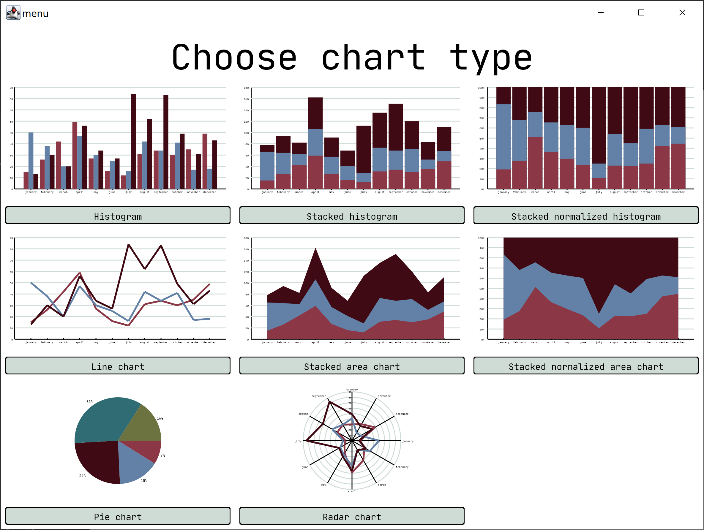
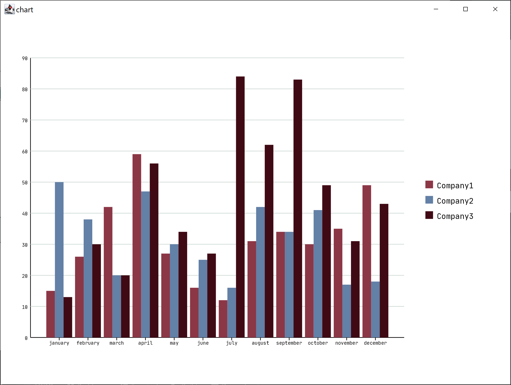
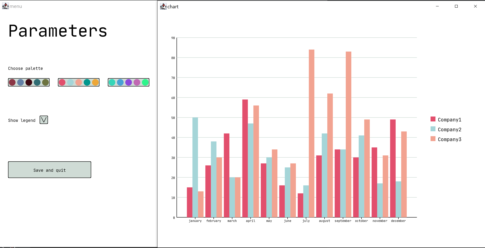

# Курс основ программирования на МКН СПбГУ
## Проект 3: визуализация данных

[Постановка задачи](./TASK.md)

### Описание работы программы

Программе в качестве аргумента командной строки передаётся имя файла
с данными для построения диаграммы.

Данные должны быть представлены в виде таблицы: первое слово в каждой 
строке - это название строки. В первой строке содержатся названия столбцов,
в остальных неотрицательные целые числа - данные. Во всех строках должно
быть равное количество слов. (см. примеры)

Если в файле больше пяти строк с данными, то отображены будут только
первые пять. Также при построении круговой диаграммы используется только
одна строка с данными, причем из неё берется не больше пяти первых значений.

При запуске программы открываются два окна - в первом будет предложено
выбрать требуемый формат диаграммы, для выбора необходимо кликнуть по
кнопке с названием диаграммы, после чего появятся параметры диаграммы, а
во втором окне требуемая диаграмма будет нарисована.

Вы можете изменять параметры диаграммы - цветовую палитру и видимость 
легенды, нажимая на соответствующие кнопки.

Для сохранения диаграммы и завершения работы программы необходимо нажать
кнопку "Сохранить и выйти". Диаграмма будет сохранена в файл output.png.

### Примеры работы программы

Файл data.txt содержит:

<pre>
Months january february march april may june july august september october november december
Company1 15 26 42 59 27 16 12 31 34 30 35 49
Company2 50 38 20 47 30 25 16 42 34 41 17 18
Company3 13 30 20 56 34 27 84 62 83 49 31 43
</pre>

При запуске программы с аргументом data.txt откроется окно

При нажатии на кнопку "Гистограмма" во втором окне
появится диаграмма

Изменение параметров:

При нажатии на кнопку "Сохранить и выйти" программа завершается
и сохраняет диаграмму в файл.