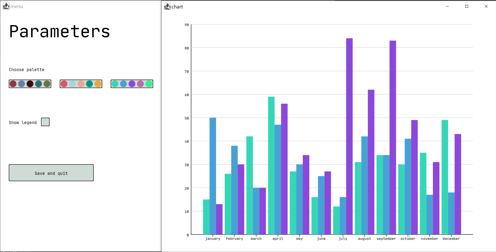

# Basics of programming course: data visualization, charts

### Usage

The name of the file with the data for building the chart
is passed to the program as the argument.

The data is presented in the form of a table (see examples).

When the program is started, two windows open - the first one offers 
the chart format selection. To select it, click on the button with the chart
name. After that the chart parameters will appear, and
in the second window the required chart will be drawn.

The chart parameters can be changed by clicking on the 
corresponding buttons.

To save the chart and stop the program, you can click the "Save and quit" 
button. The chart will be saved in file "output.png".

### Examples

File "data.txt" contains:

<pre>
Months january february march april may june july august september october november december
Company1 15 26 42 59 27 16 12 31 34 30 35 49
Company2 50 38 20 47 30 25 16 42 34 41 17 18
Company3 13 30 20 56 34 27 84 62 83 49 31 43
</pre>

When the program is run with the argument "data.txt", a window will open:

When the "Histogram" button is clicked in the second window a chart will appear:

Changing parameters:

When the "Save and quit" button is clicked, the program closes and saves the chart to a file.